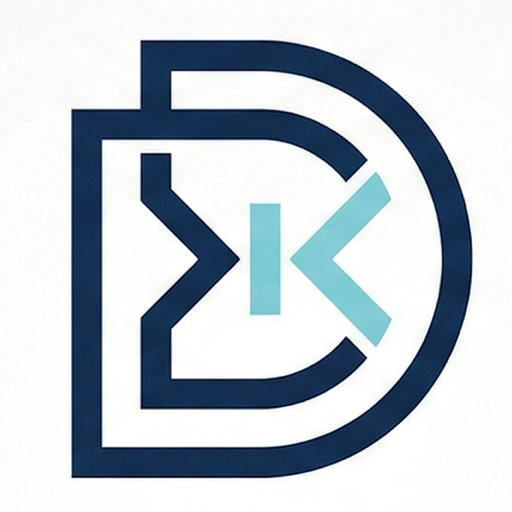

# doff

<p align="center">
  
</p>

<p align="center">
  <strong>Local-first, offline-ready diff workspace for text, images, documents, spreadsheets, and folders.</strong>
</p>

<p align="center">
  doff runs entirely in your browser — no uploads, no accounts, no servers. Compare files privately and instantly.
</p>

<p align="center">
  <a href="https://doff-franklioxygen.vercel.app"><strong>Live Demo</strong></a>
</p>

## Features

- **Text diff** — side-by-side and unified views with intraline highlighting, powered by Monaco Editor.
- **Image compare** — pixel-level diffing with overlay, side-by-side, and slider modes.
- **Document diff** — compare PDF documents page by page.
- **Spreadsheet diff** — compare Excel (.xlsx) and CSV files cell by cell.
- **Folder diff** — compare directory structures and contents.
- **Offline-ready** — installable PWA that works without an internet connection.
- **Multi-language** — English, Spanish, French, German, Japanese, and Chinese.
- **Dark mode** — automatic or manual theme switching.

## Privacy

- No account, cloud backend, analytics, or telemetry.
- All processing happens locally in your browser.
- Files never leave your machine.

## Getting Started

### Run with Docker

```bash
docker run -d -p 5560:80 --name doff ghcr.io/franklioxygen/doff:latest
```

Or use Docker Compose:

```bash
docker compose up -d
```

Then open [http://localhost:5560](http://localhost:5560).

### Build from Source

```bash
git clone https://github.com/franklioxygen/doff.git
cd doff
npm install
npm run dev
```

## Requirements

- Any modern browser (Chrome, Firefox, Safari, Edge)
- Node.js 20+ (for development)

## License

MIT
