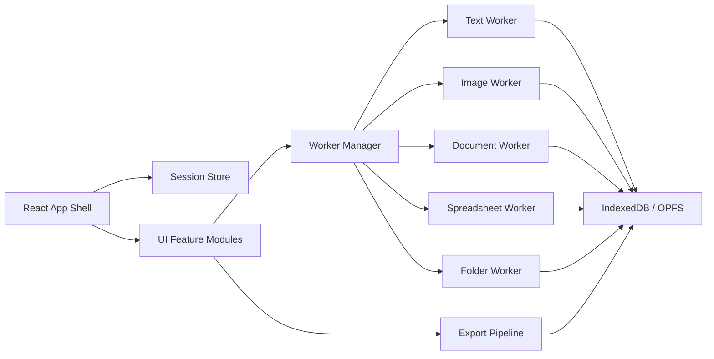

# doff Technical Design

Author: Codex
Date: March 22, 2026
Status: Draft v1

## 1. Summary

`doff` is a local-first, browser-only diff checker website modeled as closely as practical on Diffchecker's current web and desktop product surface. The primary product promise is simple:

> All comparison work happens in the browser. User content does not leave the device.

The design target is Diffchecker-like breadth, not just text diff:

- Text/code comparison
- Image comparison
- Document comparison
- Spreadsheet comparison
- Folder comparison
- Export, merge, save, and local sharing workflows

Because `doff` is browser-only, some Diffchecker features can be matched exactly, some can be approximated locally, and some must be explicitly deferred or reinterpreted:

- Exact or near-exact parity: text diff, image diff, PDF text diff, spreadsheet diff, local save/export, offline mode, dark mode, syntax highlighting, split/unified layouts, word/character precision, hide unchanged lines, drag-and-drop import.
- Approximate parity: Word/PPTX extraction, folder diff across browsers, visual document redlines, share-by-link, local AI explain, OCR.
- Out of scope for v1: SaaS accounts, billing, server-hosted link sharing, enterprise SSO, iManage, remote collaboration comments, backend encryption workflows.

This document is intended to be implementation-driving, not merely descriptive.

## 2. Goals

### 2.1 Product goals

1. Make `doff` feel immediately familiar to current Diffchecker users.
2. Keep all user data local after the app has loaded.
3. Support the main comparison modes users expect from Diffchecker.
4. Provide a polished, fast, professional UI rather than a developer-only utility.
5. Work offline after first load as a Progressive Web App (PWA).
6. Scale to realistic large files without freezing the UI.

### 2.2 Technical goals

1. Push all heavy work into Web Workers.
2. Build each diff modality on a shared session model.
3. Prefer deterministic, inspectable algorithms over opaque black boxes.
4. Use local persistence for drafts, recent sessions, and exported artifacts.
5. Keep feature modules isolated so each modality can evolve independently.

### 2.3 Non-goals

1. Building a multi-user SaaS.
2. Uploading files to a backend for processing.
3. Matching every enterprise feature from Diffchecker day one.
4. Supporting every historical binary office format in v1.
5. Shipping a native desktop app in the first phase.

## 3. Competitive Reference: Diffchecker Feature Audit

The following audit is based on Diffchecker official pages accessed on March 22, 2026:

- [Diffchecker Pro features](https://www.diffchecker.com/pro-features/)
- [Diffchecker pricing](https://www.diffchecker.com/pricing/)
- [Diffchecker desktop](https://www.diffchecker.com/desktop/)
- [Diffchecker documents compare](https://www.diffchecker.com/word-pdf-compare/)
- [Diffchecker API docs - getting started](https://www.diffchecker.com/docs/getting-started/)
- [Diffchecker API docs - document compare](https://www.diffchecker.com/docs/document/)
- [Diffchecker API docs - excel compare](https://www.diffchecker.com/docs/excel/)
- Public text-diff pages on Diffchecker expose the current text compare controls and workflow surface.

### 3.1 Observed Diffchecker feature surface

| Area | Observed on Diffchecker | Implication for doff |
| --- | --- | --- |
| Primary navigation | Text, Images, Documents, Excel, Folders | Mirror this information architecture. |
| Text compare | Real-time editor, hide unchanged lines, disable line wrap, split/unified layout, word/character precision, syntax highlighting, ignore/transform options, go to first change, edit input, copy, clear, export, share, explain | Text mode is the benchmark experience and should be the most complete module in v1. |
| Text workflows | Diff merging, file import, save diffs as files, word-level and character-level diffs, syntax highlighting, real-time edits | `doff` needs strong editing and merge affordances, not just static diff output. |
| Images | Pixel-by-pixel slider, fade, overlay, image diffing | Build one comparison core that powers multiple visual modes. |
| Documents | Compare Word and PDF documents, extract content, merge files to highlight graphic differences | Split document comparison into text-extraction diff and visual page diff. |
| Spreadsheets | X-ray-like cell diff, side-by-side spreadsheet view | Need both merged-grid and dual-sheet viewing modes. |
| Folders | Folder comparison for missing/changed items | Support directory tree diff where browser APIs allow it. |
| Export | PDF export and proprietary Diffchecker-format export | `doff` should support `.doff` session export plus human-readable PDF/HTML export. |
| Privacy | Diffchecker Desktop positions offline, local-only processing as a premium benefit | Local processing must be a core product promise, visible in the UI. |
| AI/OCR | Pricing and feature pages mention OCR and AI explain | These must be explicit optional modules with clear download and privacy messaging. |
| Security/collab | Share via link, private sharing, end-to-end encryption, comments | Server-backed collaboration features do not translate directly to browser-only v1. |
| Desktop extras | Dark mode, improved performance, Linux app, local files never leave device | PWA + local persistence should capture much of this value in the web product. |

### 3.2 Feature parity strategy

| Feature | Diffchecker position | doff v1 target | Notes |
| --- | --- | --- | --- |
| Text diff | Core | Full | Highest fidelity target. |
| Image diff | Core | Full | Full local parity is practical. |
| PDF diff | Core | Full for text diff; partial for visual diff | Text diff is realistic; visual redline needs phased rollout. |
| DOCX diff | Core | Strong | Use client-side extraction. |
| PPTX diff | Supported by upload copy | Partial | Extract text in v2. |
| Spreadsheet diff | Core | Strong | Use merged and side-by-side modes. |
| Folder diff | Desktop feature | Chromium-first, fallback elsewhere | Use File System Access API or zipped folder import. |
| Share via link | Core workflow | Local-only reinterpretation | Use compressed URL for text sessions or export file. |
| Comments | Collaboration | Deferred | Requires a persistence/sharing model. |
| AI explain | Pro feature | Optional local module | WebGPU/local model only; opt-in. |
| OCR | Pro/API feature | Optional local module | Tesseract.js or similar; opt-in. |
| iManage / SSO / enterprise | Enterprise | Out of scope | Not relevant to local browser-only v1. |

## 4. Product Definition

### 4.1 Product statement

`doff` is a privacy-first diff workspace for text, images, documents, spreadsheets, and folders. It should look and behave like a polished comparison application, not a collection of unrelated utilities.

### 4.2 Core user stories

1. As a developer, I can paste or upload two code files and instantly see split or unified diffs with syntax highlighting.
2. As a reviewer, I can hide unchanged lines, jump between changes, and merge specific edits left-to-right or right-to-left.
3. As a designer, I can compare two images with a slider, overlay, fade, and generated diff mask.
4. As a legal or operations user, I can compare PDFs and DOCX files locally without uploading them anywhere.
5. As an analyst, I can compare spreadsheets by values or formulas and hide unchanged rows/columns.
6. As a QA or release engineer, I can compare folders and drill into changed files using the correct specialized viewer.
7. As a privacy-sensitive user, I can work offline and save my session locally.

### 4.3 Success criteria

- First-time users understand within 10 seconds that files stay local.
- Text compare feels responsive for common developer workloads.
- Each modality shares a consistent mental model: import -> configure -> review -> export/save.
- The app remains usable offline after the first successful visit.
- There are no accidental network requests containing user file contents.

## 5. Constraints and Assumptions

### 5.1 Hard constraints

1. All user content processing must occur in-browser.
2. There is no app backend.
3. Static asset hosting is allowed, but runtime file content must never be transmitted.
4. The application must be deployable on static hosting.

### 5.2 Browser constraints

| Capability | Chromium | Firefox | Safari | Design response |
| --- | --- | --- | --- | --- |
| File System Access API | Strong | Limited | Limited | Use it where available, provide fallback imports elsewhere. |
| OPFS | Strong | Improving | Partial | Use IndexedDB fallback. |
| OffscreenCanvas in workers | Strong | Partial | Partial | Feature detect and degrade cleanly. |
| WebGPU | Stronger | Emerging | Emerging | Local AI is optional and gated. |

### 5.3 Format constraints

- PDF is practical in-browser with `pdfjs-dist`.
- DOCX/XLSX/PPTX are practical because they are ZIP/XML containers.
- Legacy binary formats like `.doc` and some `.xls` edge cases are harder and may require fallback messaging.
- Folder diff cannot rely on unrestricted filesystem access across all browsers.

## 6. Experience Design

### 6.1 Information architecture

Top-level routes:

- `/text`
- `/images`
- `/documents`
- `/spreadsheets`
- `/folders`
- `/settings`
- `/about/privacy`

### 6.2 App shell

The app shell should intentionally echo Diffchecker's structure:

- Top navigation bar with category tabs.
- Persistent privacy badge: `Local only`, `Offline-ready`, `No uploads`.
- Central work area with paired inputs and a result panel.
- Configuration toolbar directly above the diff output.
- Status and export controls aligned at the top-right of each workspace.

### 6.3 Visual direction

The visual system should feel professional and tool-like, not marketing-heavy:

- Light theme default with optional dark mode.
- Added content: green family.
- Removed content: red family.
- Modified content: amber/orange family.
- Neutral surfaces: soft grays with strong border hierarchy.
- Typography: `IBM Plex Sans` for UI, `IBM Plex Mono` for code/diff rows.
- Dense but breathable spacing; optimize for long review sessions.

### 6.4 Shared workspace pattern

All compare modes should use this mental model:

1. Left source
2. Right source
3. Configuration controls
4. Diff result
5. Summary stats
6. Export/save/share-local actions

### 6.5 Canonical text mode layout

```text
+----------------------------------------------------------------------------------+
| doff | Text Images Documents Spreadsheets Folders | Local only | Dark | Settings |
+----------------------------------------------------------------------------------+
| Text Compare                                                                  |
| [Open file] [Paste] [Swap]   [Open file] [Paste]                              |
| ------------------------------------------------------------------------------ |
| [Real-time] [Hide unchanged] [No wrap] [Split|Unified] [Word|Character]       |
| [Syntax: TypeScript] [Ignore ▼] [Transform ▼] [Prev] [Next] [Merge mode]      |
| ------------------------------------------------------------------------------ |
| Stats: +143 words  -98 words  21 changed blocks  3 merged                      |
| ------------------------------------------------------------------------------ |
| Left pane / diff rows                          | Right pane / diff rows         |
| virtualized synchronized gutter + inline merge actions                         |
| ------------------------------------------------------------------------------ |
| [Save .doff] [Export HTML] [Export PDF] [Copy left] [Copy right] [Share local] |
+----------------------------------------------------------------------------------+
```

### 6.6 Cross-mode behavior standards

- Drag-and-drop anywhere in a pane should load content into that side.
- `Swap` should exchange left and right sources and preserve settings.
- `Clear` should reset current session only.
- Keyboard shortcuts should be consistent across modes where possible.
- Long-running work must show cancellable progress.

## 7. Functional Requirements by Modality

### 7.1 Text compare

#### 7.1.1 Inputs

- Paste raw text.
- Open local files.
- Drag-and-drop files.
- Load prior `.doff` session.

#### 7.1.2 Supported text-like formats

- `.txt`
- `.md`
- `.json`
- `.xml`
- `.html`
- `.css`
- `.js`, `.ts`, `.jsx`, `.tsx`
- `.py`, `.rb`, `.go`, `.rs`, `.java`, `.c`, `.cpp`, `.cs`
- `.yaml`, `.toml`, `.ini`
- Generic unknown text by encoding detection

#### 7.1.3 UI controls

- Real-time diff toggle
- Hide unchanged lines
- Disable line wrap
- Split vs unified layout
- Word vs character precision
- Syntax highlighting language selector
- Ignore options:
  - Leading/trailing whitespace
  - All whitespace
  - Case changes
  - Blank lines
  - Line ending style
- Transform options:
  - Trim trailing whitespace
  - Normalize Unicode
  - Convert tabs/spaces
  - Collapse repeated blank lines
  - Sort lines (explicit power-user option)
- Go to first/previous/next change
- Edit inputs inline
- Merge left -> right or right -> left

#### 7.1.4 Output

- Split diff table
- Unified diff table
- Inline intraline highlighting
- Added/removed/changed statistics
- Copy pane content
- Copy patch
- Export HTML/PDF
- Save `.doff` session

### 7.2 Image compare

#### 7.2.1 Inputs

- PNG, JPG/JPEG, WEBP, GIF (first frame for v1), BMP
- Optional HEIC/HEIF via client-side decoder if bundle cost is acceptable
- Optional PDF page raster compare in a later phase

#### 7.2.2 Modes

- Slider compare
- Fade compare
- Overlay compare
- Diff-mask compare
- Side-by-side compare

#### 7.2.3 Controls

- Threshold/sensitivity
- Ignore antialiasing
- Background color
- Overlay opacity
- Zoom
- Pan
- Sync pan/zoom
- Fit-to-screen / 100%

#### 7.2.4 Output

- Pixel difference count
- Percentage mismatch
- Bounding boxes for changed regions
- Download diff image
- Export report

### 7.3 Document compare

#### 7.3.1 Inputs

- PDF
- DOCX
- TXT/Markdown fallback through text mode
- PPTX in later phase
- Legacy `.doc` explicitly unsupported in v1 unless a suitable client-side converter is proven reliable

#### 7.3.2 Comparison modes

- Text extraction diff
- Visual page diff
- Side-by-side page review

#### 7.3.3 Controls

- Diff by word/character for extracted text
- OCR toggle when no text layer is present
- Page sync scroll
- Page thumbnails
- Show page markers in diff output
- Highlight changed pages only

#### 7.3.4 Output

- Extracted text diff
- Per-page visual diff overlays
- Changed-page summary
- Export HTML/PDF report
- Save `.doff` session with extracted representations

### 7.4 Spreadsheet compare

#### 7.4.1 Inputs

- XLSX
- XLS
- XLSM
- XLSB
- CSV
- TSV
- ODS if supported by parser choice

#### 7.4.2 Controls

- Select left/right sheet
- Select header row
- Compare formulas vs rendered values
- Ignore case changes
- Ignore leading/trailing whitespace
- Hide unchanged rows
- Hide unchanged columns
- Merged X-ray view
- Side-by-side view

#### 7.4.3 Output

- Row-level diff metadata
- Column-level diff metadata
- Cell-level diff rendering
- Inserted/removed/modified row counts
- Export HTML/PDF/CSV report

### 7.5 Folder compare

#### 7.5.1 Inputs

- Directory picker where supported
- `<input webkitdirectory>` fallback
- ZIP file as a portable fallback for non-supporting browsers

#### 7.5.2 Behavior

- Compare by relative path
- Mark added, removed, modified, unchanged
- Show file size and modified date deltas
- Optionally compute hashes
- Open specialized child diff for changed text/image/document/spreadsheet files

#### 7.5.3 Output

- Tree/table view of path diffs
- Filters for added/removed/modified
- Summary by file type and count
- Export manifest or `.doff` session

## 8. Browser-Only Reinterpretation of Diffchecker Workflows

### 8.1 Share via link

Diffchecker supports shareable diffs. Without a backend, `doff` should reinterpret this as:

- Small text sessions: compressed URL fragment share
- Larger sessions: exported `.doff` file
- Optional "Copy review snapshot" as a self-contained HTML artifact

This preserves the workflow intent without violating the local-only constraint.

### 8.2 Private sharing / end-to-end encryption

These are backend concepts in Diffchecker's hosted product. In `doff`, the equivalent is:

- No upload by default
- Explicitly local storage
- Optional client-side encrypted export bundle in a later phase

### 8.3 AI explain

Diffchecker offers AI explanations. In `doff`, this can only be done if the explanation is also local:

- Optional local model download
- WebGPU-powered inference where available
- Strict opt-in with a visible model size and privacy notice
- Graceful absence when unsupported

### 8.4 Comments and collaborative review

True multi-user commenting is deferred. A local equivalent can be:

- Personal annotations stored in the session file
- Named bookmarks on diff hunks
- Export annotations with the report

## 9. Technical Architecture

### 9.1 Recommended stack

| Layer | Choice | Why |
| --- | --- | --- |
| Build | Vite | Fast dev loop, good worker/PWA ecosystem, static deploy friendly. |
| UI | React + TypeScript | Strong component model for multi-workspace app. |
| Styling | CSS variables + scoped utility layer or Tailwind with design tokens | Fast iteration with strong theming. |
| State | Zustand or Redux Toolkit | Shared global session state without over-complicating the app. |
| Routing | React Router | Straightforward route-per-modality model. |
| Editors | Monaco Editor | Familiar code editing, strong syntax support, diff-adjacent ergonomics. |
| Virtualization | TanStack Virtual | Required for large text/grid rendering. |
| Local persistence | IndexedDB via Dexie | Structured local session storage. |
| Offline | Workbox-based service worker | PWA and offline support. |
| Worker RPC | Comlink | Clean main-thread/worker boundary. |

### 9.2 External libraries by modality

| Modality | Primary libraries |
| --- | --- |
| Text | `diff-match-patch` or `jsdiff`, optional custom patience/Myers implementation |
| Syntax | Monaco tokenization, optional Shiki for static result rendering |
| Images | `pixelmatch`, Canvas/OffscreenCanvas, EXIF orientation helper |
| Documents | `pdfjs-dist`, `mammoth`, `jszip`, `tesseract.js` (optional) |
| Spreadsheets | `xlsx` / SheetJS |
| Export | `pdf-lib` or `jsPDF`, `file-saver`, `fflate` |
| Hashing | Web Crypto `SubtleCrypto` |

### 9.3 High-level system diagram



### 9.4 Architectural principles

1. Every modality owns its parser and result schema.
2. All heavy processing runs off the main thread.
3. The UI receives immutable result objects suitable for virtualization.
4. Session persistence stores both source metadata and computed outputs where useful.
5. The app must remain functional if optional advanced modules are unavailable.

## 10. Proposed Code Organization

```text
src/
  app/
    App.tsx
    routes.tsx
    providers/
  components/
    layout/
    common/
    diff/
  features/
    text/
      components/
      state/
      workers/
      algorithms/
      export/
    images/
    documents/
    spreadsheets/
    folders/
  lib/
    files/
    encoding/
    storage/
    export/
    worker/
    theme/
  store/
  styles/
  workers/
    worker-bootstrap.ts
```

This organization keeps modality logic together and prevents one giant "diff engine" abstraction from becoming unmaintainable.

## 11. Shared Data Model

```ts
type DiffKind = "text" | "image" | "document" | "spreadsheet" | "folder";

interface DiffSession {
  id: string;
  kind: DiffKind;
  createdAt: string;
  updatedAt: string;
  title: string;
  left: InputArtifact;
  right: InputArtifact;
  settings: Record<string, unknown>;
  result?: DiffResult;
  annotations?: Annotation[];
}

interface InputArtifact {
  sourceType: "paste" | "file" | "directory" | "generated";
  name: string;
  mimeType?: string;
  size?: number;
  handleId?: string;
  persistedBlobKey?: string;
  previewText?: string;
}

type DiffResult =
  | TextDiffResult
  | ImageDiffResult
  | DocumentDiffResult
  | SpreadsheetDiffResult
  | FolderDiffResult;
```

### 11.1 Session persistence model

- Recent sessions: IndexedDB
- Large binary blobs: IndexedDB first; OPFS when available
- Temporary worker outputs: memory + revocable object URLs
- Export bundle: `.doff` zip with manifest JSON and binary assets

## 12. Detailed Processing Pipelines

### 12.1 Text pipeline

#### 12.1.1 Pipeline steps

1. Load input from editor, dropped file, or session restore.
2. Detect encoding and decode bytes.
3. Normalize line endings to `\n`.
4. Apply configured ignore/transform rules.
5. Tokenize into lines.
6. Use a line-level diff to identify unchanged, inserted, removed, and modified blocks.
7. For modified blocks, compute intraline diff at word or character precision.
8. Build a row-oriented render model for split and unified views.
9. Compute stats.
10. Stream the result back to the UI.

#### 12.1.2 Recommended algorithm

- Primary line alignment: patience diff or Myers diff
- Intraline alignment: `diff-match-patch` or tokenized Myers
- Token granularity:
  - Word mode: whitespace-aware word tokenization
  - Character mode: grapheme-aware tokenization

Patience diff is preferred for readability when comparing code and prose because it often produces more human-friendly hunks than raw Myers on noisy edits.

#### 12.1.3 Merge operations

Each changed hunk should support:

- Accept left
- Accept right
- Accept all from left
- Accept all from right

Applying merges updates the active input buffer and re-runs the diff incrementally.

#### 12.1.4 Scaling strategies

- Virtualize rendered rows.
- Debounce real-time diff for large inputs.
- Incrementally diff only dirty ranges when feasible.
- Set thresholds that switch from live diff to explicit "Compare" button on very large files.

### 12.2 Image pipeline

#### 12.2.1 Pipeline steps

1. Decode files into `ImageBitmap`s.
2. Read EXIF orientation and normalize.
3. Rasterize onto same-size canvases, preserving aspect ratio with padding policy.
4. Compare RGBA buffers with configurable threshold.
5. Generate:
   - mismatch mask
   - changed region bounds
   - merged preview bitmaps
6. Cache derived canvases for slider/overlay/fade modes.

#### 12.2.2 Comparison algorithm

Use `pixelmatch` or equivalent for v1 because it is deterministic, well understood, and works fully client-side. Add optional SSIM later if a more perceptual metric is needed.

#### 12.2.3 Rendering modes

- Slider: single composited canvas with draggable reveal boundary
- Fade: opacity animation or manual scrubber
- Overlay: top image alpha-adjusted over bottom image
- Diff mask: changed pixels highlighted in a strong accent color

### 12.3 Document pipeline

#### 12.3.1 Type dispatch

| Type | Extraction approach |
| --- | --- |
| PDF | `pdfjs-dist` text layer extraction; page rasterization for visual compare |
| DOCX | `mammoth` or direct OOXML paragraph extraction |
| PPTX | `jszip` + OOXML text extraction in later phase |
| TXT/MD | Send to text pipeline directly |

#### 12.3.2 PDF text diff flow

1. Parse PDF.
2. Extract text per page in reading order.
3. Normalize whitespace and line joins.
4. Inject page markers into the extracted text model.
5. Send to text pipeline.
6. Map diff hunks back to pages where possible.

#### 12.3.3 Visual page diff flow

1. Render each page to canvas at a controlled DPI.
2. Align corresponding pages.
3. Run image diff.
4. Produce per-page visual overlay and changed-page summary.

#### 12.3.4 OCR flow

OCR is opt-in:

1. Detect poor or missing text extraction.
2. Offer `Enable OCR`.
3. Download OCR assets locally if not already cached.
4. Run OCR in a worker.
5. Mark OCR-derived text clearly in the UI.

### 12.4 Spreadsheet pipeline

#### 12.4.1 Workbook parsing

1. Parse both workbooks client-side.
2. Enumerate sheets and previews.
3. Let the user choose sheet and header row.
4. Convert sheet to canonical table representation.

#### 12.4.2 Alignment strategy

Columns:

- Match by header text first.
- Fall back to index-based pairing.
- Mark inserted/removed columns explicitly.

Rows:

- If a likely key column exists, use it as the primary row anchor.
- Otherwise, compare row signatures and use LCS-style alignment.
- Mark inserted/removed/modified rows.

Cells:

- Compare normalized values or formulas depending on mode.
- For modified string values, compute intraline diffs.

#### 12.4.3 Rendering strategy

- X-ray merged grid for dense review
- Side-by-side sheets for context
- Frozen row/column headers
- Virtualized grid rendering

### 12.5 Folder pipeline

#### 12.5.1 Directory ingestion

Preferred:

- `showDirectoryPicker()` on Chromium

Fallback:

- `<input webkitdirectory>`
- ZIP import with virtual extracted manifest

#### 12.5.2 Comparison strategy

1. Build a manifest of relative paths.
2. Compare path sets.
3. For matching files:
   - compare size and modified time first
   - compute hashes on demand or eagerly based on user setting
4. Classify entries as added, removed, modified, or equal.
5. For modified files, infer type and route to a specialized compare view.

#### 12.5.3 Hashing strategy

- Default: size + modified time fast path
- Optional precise mode: SHA-256 via Web Crypto
- Large files: hash in chunks with progress updates

## 13. Local Storage, Sessions, and Export

### 13.1 Session model

Every compare action creates or updates a `DiffSession`.

Persist:

- Input metadata
- Raw text or binary blob references
- Settings
- Last computed result metadata
- Optional annotations

### 13.2 Export formats

| Format | Purpose |
| --- | --- |
| `.doff` | Full-fidelity local session bundle |
| HTML | Readable review artifact |
| PDF | Shareable static report |
| PNG | Image diff mask export |
| JSON | Machine-readable stats/result summary |

### 13.3 `.doff` bundle format

Use ZIP with:

- `manifest.json`
- `inputs/left/*`
- `inputs/right/*`
- `derived/*`
- `annotations.json`

### 13.4 URL sharing

Only for small, text-only sessions:

- Store compressed session payload in URL fragment
- Hard limit on payload size
- Never attempt for binary-heavy sessions

## 14. Performance Design

### 14.1 Budgets

Target starting budgets:

- Text: up to 5 MB per side with live diff; 20 MB via manual compare
- PDF: 200 pages in text mode; visual diff paged/lazy-rendered
- Spreadsheet: 100k visible cells with virtualization
- Images: 50 MP combined before warning; tile or scale down beyond that
- Folders: 20k files manifest compare before suggesting ZIP or filtered mode

### 14.2 Performance techniques

- Web Worker processing for all heavy tasks
- Cancellation tokens for abandoned diffs
- Lazy decoding and lazy rendering
- Virtualized lists and grids
- Progressive result streaming
- Cache stable derived artifacts by content hash

### 14.3 Failure modes

If limits are exceeded:

- Warn clearly
- Offer degraded mode
- Allow manual compare instead of live compare
- Avoid browser tab crashes by refusing unsafe workloads

## 15. Privacy and Security

### 15.1 Privacy posture

The UI should always reinforce:

- Files stay on device
- No content upload
- Offline-ready after first load

### 15.2 Technical safeguards

- Strict Content Security Policy
- No analytics that inspect file content
- No third-party SDKs with opaque telemetry
- Worker isolation for untrusted parsing work
- File parsing libraries pinned and reviewed

### 15.3 Network policy

At runtime, network should be used only for:

- Initial asset load
- Explicit optional model downloads for OCR/AI
- Optional update checks if ever added

User content must never be sent.

## 16. Accessibility

### 16.1 Requirements

- WCAG AA contrast minimum
- Keyboard navigable toolbars and diff panes
- Screen-reader labels for controls and change counts
- Do not rely on red/green color alone
- Focus management for long compare workflows

### 16.2 Diff-specific accessibility

- Added/removed markers must include icons or text labels
- Change navigation should expose count and position
- Large grids need accessible summary and focus shortcuts

## 17. Testing Strategy

### 17.1 Unit tests

- Diff algorithms
- Text transforms
- Spreadsheet alignment
- Hashing and manifest logic
- Export/import bundle integrity

### 17.2 Fixture tests

Maintain representative fixtures for:

- Source code
- Legal prose
- JSON/API responses
- PDFs with and without text layers
- DOCX agreements
- Spreadsheet modifications
- Directory trees with nested changes

### 17.3 Browser tests

- Playwright end-to-end tests
- Offline mode tests
- Drag-and-drop tests
- Large-file warning tests
- No-network-content-leak tests using request interception

### 17.4 Visual regression tests

- Text diff rendering
- Image overlay UI
- Spreadsheet grid highlights
- Dark mode parity

## 18. Delivery Plan

### Phase 0: Foundation

- Vite + React + TypeScript app shell
- PWA/offline plumbing
- Session store
- Shared layout and design tokens

Exit criteria:

- App loads offline after first visit
- Shared shell and route structure exist

### Phase 1: Text compare

- Monaco-based inputs
- Split/unified diff
- Word/character precision
- Syntax highlighting
- Ignore/transform options
- Export `.doff` and HTML

Exit criteria:

- Text mode is production-usable for common code/prose diffs

### Phase 2: Images and documents

- Image compare modes
- PDF text diff
- DOCX extraction diff
- Basic visual page diff for PDFs

Exit criteria:

- Designers and document reviewers can use the app end-to-end locally

### Phase 3: Spreadsheets and folders

- Spreadsheet compare
- Directory/ZIP compare
- Drill-down into child diffs

Exit criteria:

- The app covers Diffchecker's core modality set

### Phase 4: Advanced local workflows

- OCR
- Local AI explain
- Encrypted export
- Personal annotations
- More office formats

Exit criteria:

- Advanced parity features exist without compromising local-first guarantees

## 19. Major Risks and Mitigations

| Risk | Impact | Mitigation |
| --- | --- | --- |
| Browser memory exhaustion on large files | High | Workers, virtualization, hard limits, degraded modes |
| Inconsistent directory access across browsers | Medium | Chromium-first support plus ZIP fallback |
| Poor DOCX/PPTX extraction fidelity | Medium | Start with DOCX, clearly label supported formats, keep visual diff separate |
| OCR/AI bundle size | Medium | Opt-in download, cache locally, keep core app independent |
| Complex spreadsheet alignment edge cases | High | Provide manual sheet/header controls and clear diff heuristics |
| Over-abstracted shared diff engine | Medium | Keep modality-specific pipelines with shared infrastructure only |

## 20. Open Decisions

1. Whether v1 should include dark mode immediately or after text mode stabilizes.
2. Whether HEIC and PPTX support justify the bundle weight in the first release.
3. Whether local AI explain is worth the complexity before spreadsheet/folder parity is complete.
4. Whether URL-share should be text-only or omitted from the first public release.
5. Whether visual PDF redline export should be HTML-first rather than PDF-first in v1.

## 21. Recommended Initial Build Order

If implementation starts immediately, the recommended order is:

1. Foundation and shared shell
2. Text compare
3. Export/save/session restore
4. Image compare
5. PDF/DOCX compare
6. Spreadsheet compare
7. Folder compare
8. Optional OCR/AI/annotations

This order matches the highest-value Diffchecker workflows while minimizing early architectural risk.

## 22. Appendix: Direct Parity Mapping

| Diffchecker surface | doff equivalent |
| --- | --- |
| Text | `/text` with Monaco inputs and virtualized diff renderer |
| Images | `/images` with slider/overlay/fade/diff-mask |
| Documents | `/documents` with PDF/DOCX extraction + visual page compare |
| Excel | `/spreadsheets` with merged and side-by-side grids |
| Folders | `/folders` with directory/ZIP diff |
| Share | URL fragment for small text sessions or `.doff` file |
| Explain | Optional local WebGPU model |
| Save diffs as files | `.doff`, HTML, PDF, JSON, PNG |
| Offline desktop privacy value | PWA + worker-based local-only processing |

## 23. Conclusion

The correct way to make `doff` "as close as possible" to Diffchecker is not to clone its marketing or copy every hosted feature literally. It is to reproduce the same product shape and review workflows while treating browser-only local processing as the core architectural constraint.

That means:

- text mode must be excellent,
- the modality set must match Diffchecker's navigation,
- save/export/local sharing must replace server workflows,
- and privacy must be visible, not implied.

If this design is followed, `doff` can plausibly occupy the same mental category as Diffchecker while still being honest about what a browser-only product can and cannot do.
